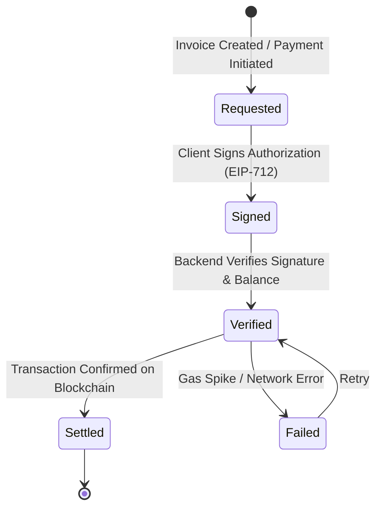
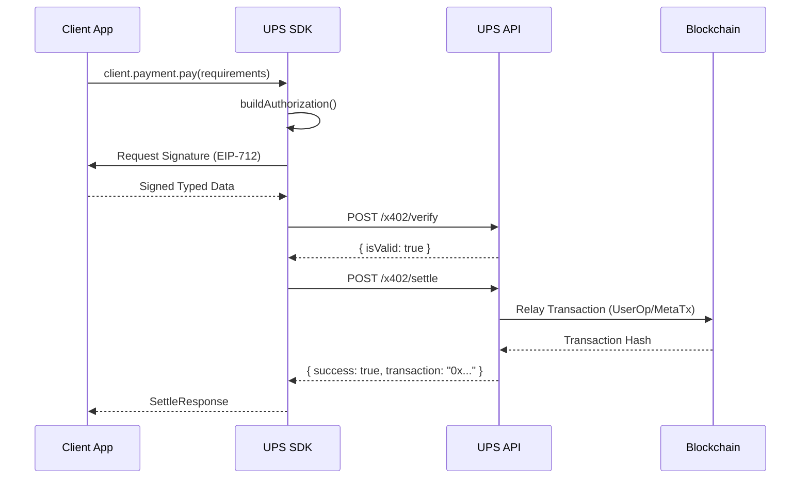

# UPS x402 Architecture

This document provides a high-level overview of the Universal Payments System (UPS) architecture and the x402 state machine.

## High-Level Overview

The UPS ecosystem consists of three main components:
1.  **Client App**: Your application using the `@gatewayfm/ups-sdk`.
2.  **UPS Backend (Relayer)**: Validates payment requests and relays transactions to the blockchain.
3.  **Blockchain**: The settlement layer (e.g., TAU, Base) where Smart Accounts and Assets live.

```mermaid
graph TD
    Client[Client App + SDK] -->|1. Auth & Sign| UPS[UPS Backend / Relayer]
    UPS -->|2. Verify & Relay| Chain[Blockchain (TAU/Base)]
    
    subgraph On-Chain
        SA[Smart Account]
        Asset[Token Contract]
        SA -->|3. Transfer| Asset
    end
```

## x402 State Machine

The x402 protocol defines a strict state machine for payments to ensure security and determinism.



### States
- **Requested**: The payment intent is created (e.g., an Invoice is generated).
- **Signed**: The user's Smart Account owner key has signed the `transferWithAuthorization` message.
- **Verified**: The UPS Backend has checked the signature validity and account balance off-chain.
- **Settled**: The transaction has been successfully included in a block.

## Payment Sequence

The following sequence describes the `client.payment.pay()` flow.


